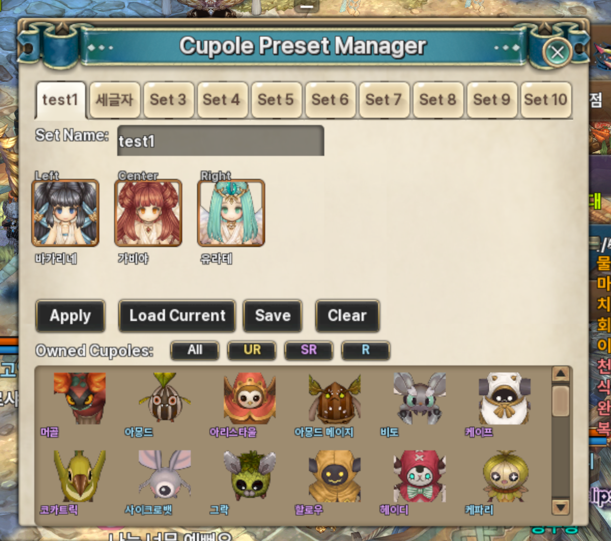

# Cupole Manager

Tree of Savior용 **Cupole 프리셋/자동 소환 애드온**입니다.  
도시 진입 시 설정된 조합을 자동으로 맞추고, 프리셋 UI에서 빠르게 저장/적용할 수 있습니다.

## 왜 쓰나요?

- 매번 수동으로 큐폴 조합을 맞추는 반복 작업 감소
- 캐릭터별 세팅 + 기본(Default) 세팅 동시 관리
- 빠른 적용 UI(`/cupole q`)로 전투 전 준비 시간 단축
- Norisan 메뉴 연동으로 접근성 개선

## 주요 기능

- **자동 소환**: 도시(`MapType == City`) 진입 시 3슬롯 자동 보정
- **기본 세트 저장**: 현재 3슬롯을 Default로 저장
- **프리셋 10개 관리**: 이름 지정, 저장/불러오기/초기화
- **퀵 프리셋 창**: 간소화된 목록에서 즉시 Apply
- **설정 영속화**: JSON 파일에 안전 저장(tmp fallback 포함)
- **스킬 퀵슬롯 보정**: 프리셋 적용 후 큐폴 액티브 스킬 스왑 시도

## 사용법

1. 게임에서 `/cupole` 입력: 전체 프리셋 UI 열기
2. `/cupole q` 또는 `/cupole quick`: 퀵 프리셋 UI 열기
3. `Load Current`로 현재 장착 상태를 가져온 뒤 `Save`
4. 원하는 탭에서 `Apply`로 즉시 소환 적용

## 저장 경로

- `../addons/cupole_manager/<AID>/cupole_manager.json`
- `../addons/norisan_menu/settings.json` (메뉴 위치/레이어 설정)

## 프로젝트 구조

```text
tos-addon/
├─ cupole_manager/
│  ├─ cupole_manager.lua   # 메인 로직 (UI, 프리셋, 훅, 저장)
│  └─ cupole_manager.xml   # UI 프레임 진입점
├─ addons.json             # 매니페스트(현재 플레이스홀더)
└─ README.md
```

## Screenshot
