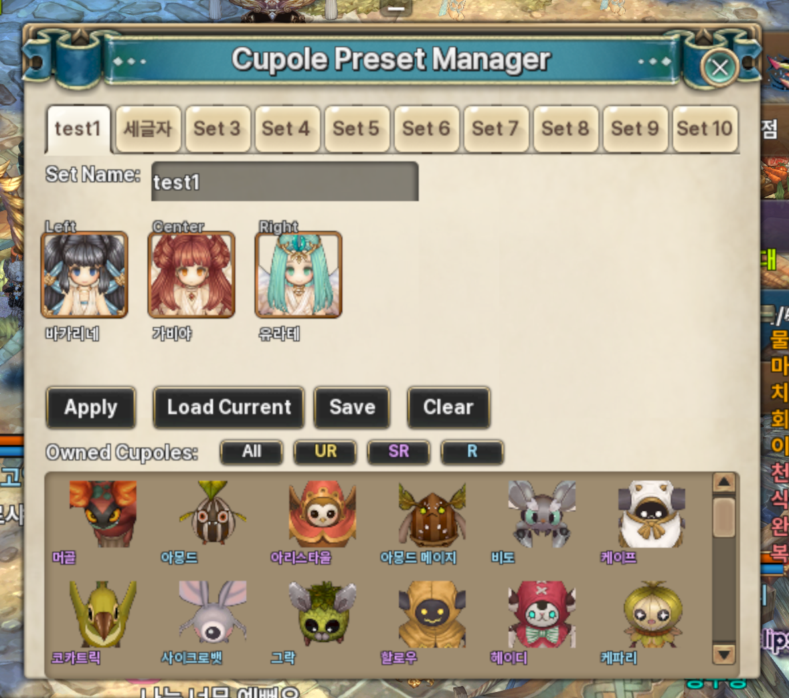
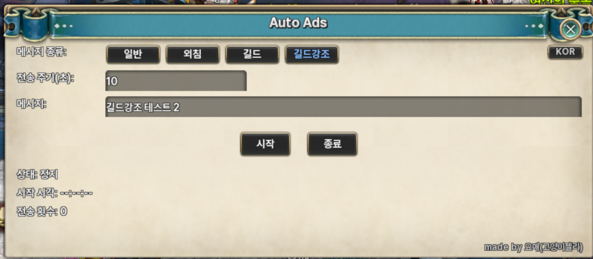

# Cupole Manager

Tree of Savior용 **Cupole 프리셋/자동 소환 애드온**입니다.  
도시 진입 시 설정된 조합을 자동으로 맞추고, 프리셋 UI에서 빠르게 저장/적용할 수 있습니다.

## 왜 쓰나요?

- 매번 수동으로 큐폴 조합을 맞추는 반복 작업 감소
- 캐릭터별 세팅 + 기본(Default) 세팅 동시 관리
- 빠른 적용 UI(`/cupole q`)로 전투 전 준비 시간 단축
- Norisan 메뉴 연동으로 접근성 개선

## 주요 기능

- **자동 소환**: 도시(`MapType == City`) 진입 시 3슬롯 자동 보정
- **기본 세트 저장**: 현재 3슬롯을 Default로 저장
- **프리셋 10개 관리**: 이름 지정, 저장/불러오기/초기화
- **퀵 프리셋 창**: 간소화된 목록에서 즉시 Apply
- **설정 영속화**: JSON 파일에 안전 저장(tmp fallback 포함)
- **스킬 퀵슬롯 보정**: 프리셋 적용 후 큐폴 액티브 스킬 스왑 시도

## 사용법

1. 게임에서 `/cupole` 입력: 전체 프리셋 UI 열기
2. `/cupole q` 또는 `/cupole quick`: 퀵 프리셋 UI 열기
3. `Load Current`로 현재 장착 상태를 가져온 뒤 `Save`
4. 원하는 탭에서 `Apply`로 즉시 소환 적용

## 저장 경로

- `../addons/cupole_manager/<AID>/cupole_manager.json`
- `../addons/norisan_menu/settings.json` (메뉴 위치/레이어 설정)

## 프로젝트 구조

```text
tos-addon/
├─ cupole_manager/
│  ├─ cupole_manager.lua   # 메인 로직 (UI, 프리셋, 훅, 저장)
│  └─ cupole_manager.xml   # UI 프레임 진입점
├─ addons.json             # 매니페스트(현재 플레이스홀더)
└─ README.md
```

## Screenshot


---

# Toggle Cupole Potion     

쿠폴 자동 물약 사용을 키보드 \ 키 한 번으로 토글하는 애드온입니다.

## Features
 - \ 키로 쿠폴 자동 물약 ON/OFF 토글(Toggle Cupole auto-potion ON/OFF with \ key)
 - /tcp 슬래시 커맨드로도 토글 가능(Also available via /tcp slash command)
 - 토글 시 채팅 로그에 현재 상태 (ON/OFF) 표시(Current state (ON/OFF) displayed in chat log on toggle)
 - 마을에서는 토글 불가 (게임 제한사항) (Cannot toggle in city (game restriction))

## Notes
- 쿠폴 물약이 장착되어 있어야 동작합니다. (Cupole potion must be equipped for this to work)
- 채팅 입력 중에는 \ 키가 동작하지 않을 수 있습니다. (\ key may not respond while typing in chat)

---

# Auto Ads

지정한 메시지를 일정 주기로 자동 전송하는 애드온입니다.
An addon that automatically sends a specified message at regular intervals.

## 주요 기능 / Features

- **4가지 채널 지원 / 4 Channel Types**: 일반(`/s`), 외침(`/y`), 길드(`/g`), 길드강조(`/gn`)
  Normal, Shout, Guild, Guild Notice
- **주기 설정 / Interval Setting**: 초 단위로 전송 주기 설정 (외침: 최소 60초, 그 외: 최소 10초)
  Set interval in seconds (Shout: min 60s, others: min 10s)
- **한/영 전환 / KOR/ENG Toggle**: UI 우측 상단 KOR/ENG 버튼으로 언어 전환
  Switch language via KOR/ENG button on the top right
- **확성기 자동 감지 / Megaphone Detection**: 외침 채널 사용 시 확성기 소진 시 자동 정지
  Auto-stops when megaphones run out (Shout channel)
- **실시간 상태 표시 / Live Status**: 경과 시간, 전송 횟수, 확성기 잔량 표시
  Shows elapsed time, send count, and remaining megaphones

## 사용법 / Usage

1. UI 열기 (Open UI)
2. 메시지 종류 선택 (Select message type)
3. 전송 주기(초)와 메시지 입력 (Enter interval and message)
4. `시작/Start` 클릭 (Click Start)



## 저장 경로 / Save Path

- `../addons/auto_ads/<AID>/auto_ads.json`

## Notes
- 외침(`/y`) 사용 시 확성기 아이템이 필요합니다. (Megaphone item required for Shout channel)
- 실행 중 UI를 닫으면 자동으로 정지됩니다. (Closing the UI while running will auto-stop)