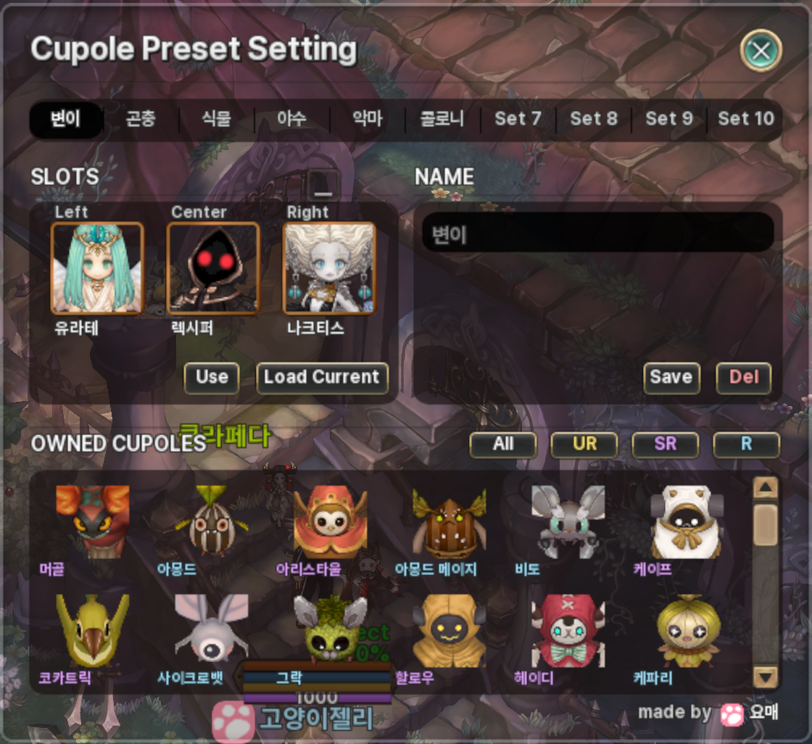
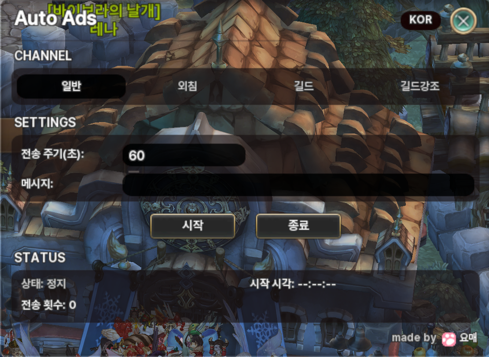

# Cupole Manager

Tree of Savior용 **Cupole 프리셋/자동 소환 애드온**입니다.  
도시 진입 시 설정된 조합을 자동으로 맞추고, 프리셋 UI에서 빠르게 저장/적용할 수 있습니다.

## 왜 쓰나요?

- 매번 수동으로 큐폴 조합을 맞추는 반복 작업 감소
- 캐릭터별 세팅 + 기본(Default) 세팅 동시 관리
- 도시에서 항상 떠 있는 프리셋 HUD로 전투 전 준비 시간 단축
- 메뉴를 거치지 않고 HUD 바에서 바로 설정창까지 열리는 단일 진입점

## 주요 기능

- **자동 소환**: 도시(`MapType == City`) 진입 시 3슬롯(Center/Left/Right) 자동 보정
- **기본 세트 저장**: 현재 3슬롯을 Default로 저장
- **프리셋 10개 관리**: 이름 지정, 저장/불러오기/초기화
- **프리셋 HUD**: 도시에서 화면 오른쪽에 뜨는 작은 토글 바 → 저장된 프리셋을 클릭 한 번으로 적용
  (드래그로 위치 이동, 위치/열림 상태는 계정 단위로 저장)
- **프리셋 창**: 저장한 프리셋 이름이 그대로 보이는 탭 10개, 슬롯/이름/보유 큐폴을 나눈 구역 배치
- **설정 영속화**: JSON 파일에 안전 저장(`.tmp` → rename 방식)
- **스킬 퀵슬롯 보정**: 프리셋 적용 후 큐폴 액티브 스킬 스왑 시도

## 사용법

1. 도시에 들어가면 화면 오른쪽에 **프리셋 HUD 바**가 뜹니다
2. 바의 **톱니 버튼**을 누르면 프리셋 창이 열립니다 (설정창 진입점은 여기 하나입니다)
3. 바의 **on/off 아이콘**을 누르면 프리셋 목록 패널이 펼쳐지고 접힙니다
4. 프리셋 창에서 `Load Current`로 현재 장착 상태를 가져온 뒤 `Save`
5. 원하는 탭에서 `Apply`로 즉시 소환 적용 (HUD 패널에서는 프리셋 줄을 클릭하면 바로 적용)

> v1.0.3부터 Norisan 메뉴의 `Cupole Preset` 항목은 **제거**되었습니다. 메뉴에 항목이
> 남아 있다면 애드온이 시작할 때 자동으로 지웁니다.

## 저장 경로

- `../addons/cupole_manager/<AID>/cupole_manager.json`
- `../addons/norisan_menu/settings.json` (메뉴 위치/레이어 설정)

## 프로젝트 구조

```text
tos-addon/
├─ cupole_manager/
│  ├─ cupole_manager.lua   # 메인 로직 (UI, 프리셋, HUD, 훅, 저장)
│  ├─ cupole_manager.xml   # UI 프레임 진입점
│  ├─ _ipf/                # 배포용 .ipf 산출물
│  └─ RELEASE_v1.0.2.md    # 릴리즈 노트 (이후 버전은 GitHub Release 참고)
├─ toggle_cupole_potion/   # 쿠폴 자동 물약 토글
├─ auto_ads/               # 확성기/채팅 자동 전송
├─ auto_keeper/            # 자동 관리 HUD (스태미나/물약/성물/수리/바카리네)
├─ convenient_hud/         # 편의 설정 HUD (이펙트·자동시전·큐폴물약)
├─ new_nexus_addons/       # Nexus Addons 번들 (yomae 포크)
├─ addons.json             # 애드온 매니저용 매니페스트 (버전/릴리즈 태그/설명)
└─ README.md
```

> `ipf_maker/`(빌드 도구·산출물)와 일부 실험용 애드온 폴더는 git에 커밋하지 않는 로컬 전용입니다.
> 배포는 GitHub Release 에셋(`.ipf`)으로만 합니다.

## Screenshot


---

# Toggle Cupole Potion     

쿠폴 자동 물약 사용을 키보드 \ 키 한 번으로 토글하는 애드온입니다.

## Features
 - \ 키로 쿠폴 자동 물약 ON/OFF 토글(Toggle Cupole auto-potion ON/OFF with \ key)
 - /tcp 슬래시 커맨드로도 토글 가능(Also available via /tcp slash command)
 - 토글 시 채팅 로그에 현재 상태 (ON/OFF) 표시(Current state (ON/OFF) displayed in chat log on toggle)
 - 마을에서는 토글 불가 (게임 제한사항) (Cannot toggle in city (game restriction))

## Notes
- 쿠폴 물약이 장착되어 있어야 동작합니다. (Cupole potion must be equipped for this to work)
- 채팅 입력 중에는 \ 키가 동작하지 않을 수 있습니다. (\ key may not respond while typing in chat)

---

# Auto Ads

지정한 메시지를 일정 주기로 자동 전송하는 애드온입니다.
An addon that automatically sends a specified message at regular intervals.

## 주요 기능 / Features

- **4가지 채널 지원 / 4 Channel Types**: 일반(`/s`), 외침(`/y`), 길드(`/g`), 길드강조(`/gn`)
  Normal, Shout, Guild, Guild Notice
- **주기 설정 / Interval Setting**: 초 단위로 전송 주기 설정 (외침: 최소 60초, 그 외: 최소 10초)
  Set interval in seconds (Shout: min 60s, others: min 10s)
- **한/영 전환 / KOR/ENG Toggle**: UI 우측 상단 KOR/ENG 버튼으로 언어 전환
  Switch language via KOR/ENG button on the top right
- **확성기 자동 감지 / Megaphone Detection**: 외침 채널 사용 시 확성기 소진 시 자동 정지
  Auto-stops when megaphones run out (Shout channel)
- **실시간 상태 표시 / Live Status**: 경과 시간, 전송 횟수, 확성기 잔량 표시
  Shows elapsed time, send count, and remaining megaphones

## 사용법 / Usage

1. UI 열기 (Open UI)
2. 메시지 종류 선택 (Select message type)
3. 전송 주기(초)와 메시지 입력 (Enter interval and message)
4. `시작/Start` 클릭 (Click Start)



## 저장 경로 / Save Path

- `../addons/auto_ads/<AID>/auto_ads.json`

## Notes
- 외침(`/y`) 사용 시 확성기 아이템이 필요합니다. (Megaphone item required for Shout channel)
- 실행 중 UI를 닫으면 자동으로 정지됩니다. (Closing the UI while running will auto-stop)

---

# Auto Keeper

반복되는 관리 작업 다섯 가지를 HUD 아이콘 하나씩으로 켜고 끄는 애드온입니다.
Five upkeep chores on one HUD bar, each toggled by its own icon.

## 주요 기능 / Features

| 아이콘 / Icon | 동작 / What it does |
|---|---|
| 스태미나 알약 / Stamina pills | 스태미나가 최대치의 **20% 이하**면 알약을 한 알씩 먹습니다. 도시와 이벤트 맵에서는 동작하지 않습니다<br>Eats one pill at a time below 20%; does nothing in cities or event maps |
| 물약 회복 버프 해제 / Potion heal buff | 체력이 **40% 이상**이 되면 물약 회복 버프를 해제합니다<br>Removes the potion heal buff once HP is back at 40% or above |
| 성물 마력 보완 충전 / Relic power | 던전 입장창에서 마력이 덜 찼으면 엑토나이트로 채웁니다<br>Fills relic power with Ectonite at the dungeon entry window |
| 장비 자동 수리 / Gear repair | 내구도가 **30% 미만**인 장비를 긴급 수리 키트로 수리하고, 부족하면 필요한 수량만큼만 자동 구매합니다(설정에서 켜야 동작)<br>Repairs gear under 30% durability, buying only as many kits as the repair needs (auto-buy must be switched on) |
| 바카리네 장비 탈착 / Vakarine gear | 인스턴스 던전에 들어가면 선택한 부위를 벗었다가 다시 착용합니다. 바카리네 축복 5세트를 착용했을 때만 동작합니다<br>Unequips and re-equips the slots you picked on instance dungeon entry, only with the 5-piece Vakarine blessing set |

- **기본값은 전부 꺼짐**입니다. 아이템을 소비하는 기능이라 직접 켜야 합니다
  Everything is off by default because it all spends items
- 아이콘을 누르면 켜짐/꺼짐이 색으로 바뀌고, 마우스를 올리면 밝아집니다
  Click an icon to switch it on or off; it brightens on mouse over
- **수리 아이콘 우클릭** → 수리 키트 자동 구매 설정(1회 최대 구매 수량 지정 가능)
  Right click the repair icon for the auto-buy settings
- **바카리네 아이콘은 조작이 다릅니다** — 좌클릭은 지금 실행, 우클릭은 `자동 실행 켜기/끄기`와 설정창입니다
  The Vakarine icon differs: left click runs it now, right click opens auto-run on/off and its settings
- HUD는 드래그로 옮기면 위치가 저장되고, `/keeper` 로 표시를 켜고 끕니다
  Drag the bar to move it; `/keeper` shows or hides it

## 바카리네 설정창 / Vakarine settings

- **맵 진입 시 자동 실행** — 캐릭터별로 저장됩니다 (Auto run on map entry, saved per character)
- **주간 보스 레이드에서도** — JSR 8종 맵 포함 여부. 일반 인스턴스 던전은 이 설정과 무관하게 동작합니다
  (Whether the 8 weekly boss raid maps count; ordinary instance dungeons always run)
- **탈착할 장비** — 부위를 눌러 켜고 끕니다. 목걸이를 고르면 애니무스는 맨 마지막에 처리합니다
  (Pick the slots; with the necklace selected, the Animus is handled last)
- **체력바에 상태 표시** — 체력바 위에 HP % 와 완벽/복수를 띄웁니다
  (HP percentage plus Perfect / Revenge above the HP bar)

| 표시 / Label | 조건 / Condition |
|---|---|
| 완벽 / Perfect | 완벽함 수치가 있을 때 체력 100% (perfection value present, HP at 100%) |
| 복수 / Revenge | 5세트면 체력 45% 이하, 5세트 미만이면 복수 수치가 있을 때 35% 이하 (45% with the 5-piece set, 35% with a revenge value and fewer pieces) |

## 진단 명령 / Diagnostics

- `/keeper buff` — 지금 붙어 있는 버프 ID 목록 (current buff ids)
- `/keeper dur` — 수리 키트 수량·쿨다운·장비별 내구도 (kit count, cooldown, per-slot durability)
- `/keeper vk` — 바카리네 자동 실행이 안 도는 이유 (why auto run is not firing)
- `/keeper opt` — 스탯창 특수 옵션 수치(완벽함·복수) (the perfection / revenge values)

## 저장 경로 / Save Path

- `../addons/auto_keeper/<AID>/auto_keeper.json`

## ⚠️ 먼저 꺼 주세요 / Turn these off first

같은 일을 하는 애드온을 함께 쓰면 **아이템을 두 배로 소모합니다.**
Two copies of the same job burn twice the items.

- `autostamina` / `no_potion` → `.ipf` 를 `data/` 에서 빼 주세요 (remove the `.ipf` from `data/`)
- Nexus Addons 의 **Auto Repair**, **Vakarine Equip** → 설정에서 끄기 (switch off in its settings)
- mini_addons 의 **성물 자동충전** → 설정에서 끄기 (switch off in its settings)

> 게임 기본 옵션인 `성물(마력) 자동충전` 은 **그대로 켜 두세요.** 이 애드온은 그것을 대체하는 게
> 아니라, 그것이 놓치는 인던 입장 직전 상황만 메꿉니다.
> Leave the game's own relic auto charge on; this only fills the gap it leaves.

---

# Convenient HUD

자주 바꾸는 그래픽/전투 옵션을 설정창에 들어가지 않고 화면에서 바로 전환하는 애드온입니다.
Flip frequently-changed graphics and combat options in place, without opening the option window.

## 주요 기능 / Features

- **다른 캐릭터 이펙트 보기 / Show other PC effects** — 즉시 반영되지 않으면 재접속 후 적용됩니다
  (applies after re-entering if it does not change at once)
- **캐스팅/채널링 자동 시전 / Auto cast while casting**
- **큐폴 자동물약 사용 / Cupole auto potion** — 도시에서는 전환할 수 없습니다 (게임 제한)
  (cannot be toggled in a city — a game restriction)
- **이펙트 선명도 3종 / Three effect clarity sliders** — 내 이펙트 / 다른 캐릭터 이펙트 / 보스 몬스터 이펙트를
  각각 10 · 25 · 50 · 75 · 100% 버튼으로 지정합니다 (my / other PC / boss effects, five preset steps each)

## 사용법 / Usage

1. HUD 바의 on/off 아이콘을 누르면 옵션 패널이 펼쳐지고 접힙니다
   Click the on/off icon on the bar to open and close the panel
2. 토글은 눌러서 바로 전환, 선명도는 원하는 % 버튼을 누릅니다
   Toggles flip on click; for clarity, press the percentage you want
3. 바를 드래그하면 위치가 저장됩니다 (Drag the bar to move it; the position is saved)

## Notes

- **값을 저장하지 않습니다.** 창을 열 때마다 클라이언트의 현재 값을 읽어 보여줍니다.
  mini_addons 등 다른 애드온도 같은 옵션을 로그인마다 밀어넣기 때문에, 사본을 들고 있다가 다시
  적용하면 서로 덮어쓰는 싸움이 됩니다.
  Nothing is cached — the current client value is read every time. Other addons push the same
  options at login, so keeping a private copy would just be a fight over who writes last.
- 선명도는 % 가 아니라 0~255 알파값이며, 게임 설정창 표시값과 맞도록 raw 값을 골랐습니다.
  Clarity is a 0–255 alpha, not a percent; the raw values are picked to match the option window.

## 저장 경로 / Save Path

- `../addons/convenient_hud/<AID>/convenient_hud.json` (HUD 위치/열림 상태만 / HUD position and open state only)

---

# New Nexus Addons

Ajinori의 Nexus Addons를 이어받은 통합 애드온 번들입니다. `Ctrl + ~`(백틱) 키로 토글 창을 열 수 있습니다.
A merged bundle continuing Ajinori's Nexus Addons. Press `Ctrl + ~` (backtick) to open the toggle window.

> 기존 nexus_addon `.ipf` 파일만 삭제한 뒤 설치하세요.
> Remove only the old nexus_addon `.ipf` file before installing.

## 주요 기능 / Features

- **CCH 장비 세트 프리셋 / CCH Equipment Set Presets**: Character Change Helper에서 장비 세트를
  **3개(Set1/2/3)**까지 등록하고 골라서 장착할 수 있습니다.
  Register up to 3 equipment sets (Set1/2/3) in Character Change Helper and equip the one you pick.
  - **빼기(창고→장착) / Take out (Warehouse → Equip)**: 빼기 버튼 **우클릭 → 세트 선택**으로 원하는 세트만 장착
    Right-click the take-out button → pick a set to equip only that set
  - **넣기(장착→창고) / Store (Equip → Warehouse)**: 현재 착용 중인(=현재 세트) 등록 아이템을 그대로 예치
    Deposits the currently worn (current set) registered items as-is
  - **설정창 탭 / Setting Tabs**: 설정창 상단 `[Set1][Set2][Set3]` 탭으로 세트별 아이템 등록/편집
    Register/edit items per set via the `[Set1][Set2][Set3]` tabs at the top of the settings window
  - **창고 없이 조작 / Store·Equip buttons**: 설정창의 `収納/Store`, `装着/Equip` 버튼으로 창고에서 바로 예치/장착
    Deposit/equip directly from the settings window's `収納/Store` and `装着/Equip` buttons
  - 기존 1세트 설정은 자동으로 **Set1으로 마이그레이션**됩니다. (Existing single-set config auto-migrates to Set1)
- **Zmei 하드레이드 물약 자동 교체 / Zmei Hard Raid Auto-Potion**: Zmei 하드레이드 클릭 시 속성 물약을 자동 교체
  Auto-swaps attribute potions when entering the Zmei hard raid

## 저장 경로 / Save Path

- `../addons/<nexus addons 설정 경로>` (애드온 내부 규칙에 따름 / per the addon's own convention)

## Notes
- 인게임 반영을 위해서는 `.ipf` 재패킹이 필요합니다. (Repacking the `.ipf` is required to apply changes in-game)
- 소스 원본은 `new_nexus_addons/_nexus_addons.lua`이며, `ipf/`·`ipf_maker/`는 패킹용 복사본입니다.
  The source of truth is `new_nexus_addons/_nexus_addons.lua`; `ipf/` and `ipf_maker/` are packing copies.